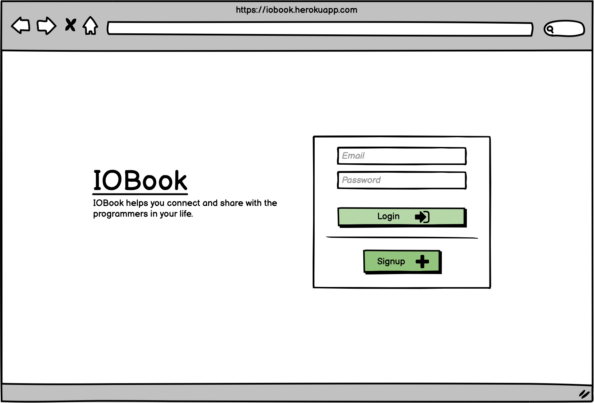

# IOBook

A social platform for software developers.

## The team

[](https://github.com/tomal02) Tom | [](https://github.com/Ifrahhssn) Ifrah | [](https://github.com/jordanveness) Jordan | [](https://github.com/rhianekobar) Shakira | [](https://github.com/lildann) Lilly | [](https://github.com/borisl16) Boris

## How to use

#### Hosted on Heroku
You can use a hosted version of IOBook at Heroku [here](https://iobook.herokuapp.com)

<!-- ### Run locally -->

## Planning

#### Trello Board

We used a Trello board to organise our workflow, you can find it [here](https://trello.com/b/hf33wxGn/acebook-project)

### Wireframe



<!--
### Domain model


### User stories
```
As a programmer
So I can join the network
I want to be able to sign up 

As a programmer
So that I can access my account
I want to be able to log in 

As a user
So that I can update my status
I want to be able to write a new post

As a user
So that I can view all my posts
I want to be able to visit my profile

As a user
So I can see when posts were written
I want my feed to be organised chronologically by most recent

As a user
In case I make a spelling mistake 
I want to be able to update my posts

As a user 
If I post something by accident
I want to be able to delete my posts


```
## Quickstart

First, clone this repository. Then:

```bash
> bundle install
> bin/rails db:create
> bin/rails db:migrate

> bundle exec rspec # Run the tests to ensure it works
> bin/rails server # Start the server at localhost:3000
```

## Troubleshooting

If you don't have Node.js installed yet, you might run into this error when running rspec:

```
ExecJS::RuntimeUnavailable:
  Could not find a JavaScript runtime. See https://github.com/rails/execjs for a list of available runtimes.
 ```

Rails requires a Javascript runtime to work. The easiest way is to install Node by running `brew install node` - and then run `bundle exec rspec` again
-->
